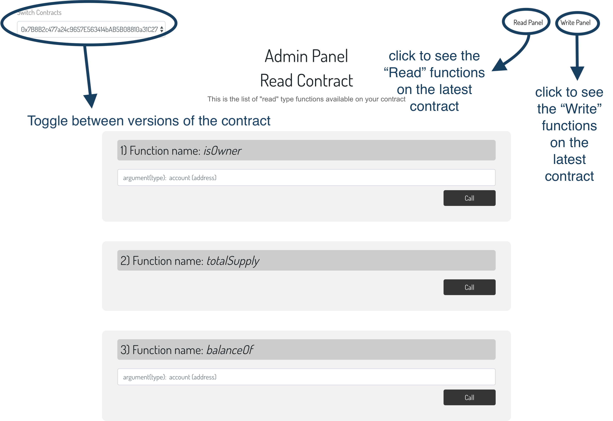

# Upgradable-Proxy-Box

This box comes with everything you need to build upgradable-proxy contracts. We also 
have a simple react-app shipped along with it that you can use to see
how __you can update a contract without losing any data__.

## Installation

First ensure that you are in an empty repository.


1. Create a new directory and unbox the box using `unbox` command using truffle
```bash
mkdir proxyBox
cd proxyBox
truffle unbox pranav-singhal/upgradable-proxy-box
```
2. Install the box dependencies

```bash
yarn install
```

3. Run the development console
```bash
truffle dev
```
 OR
 ```bash
truffle develop
```
4. In the console now open run the `compile` and `migrate` 

```js
compile // compile the contracts
```
```js
migrate // migrate the contracts
```
This will compile and migrate your contracts. It will also create the ABIs and put them inside the `app` folder
 
5. Go into your `app` folder and `yarn install` the react app

```bash
cd app
yarn install
```

6. In the same folder, `yarn start ` the react app

```bash
yarn start
```
 

## How it Works

The box has three parts

1. Contracts

> There are 7 Primary Contracts
>1. *Ownable.sol*  - this is the contract that manages the owner of all the contracts
>2. *TokenStorage.sol* - the contract that stores all the storage variables, their getter and setter functions.
>All storage variables must be defined inside this contract
>3. *Proxy.sol* - this is the proxy contract that delegates calls from different versions of the implementation contract
>to the storage contract( *TokenStorage.sol*)
>4. *UpgradeabilityProxy.sol* - this contract inherits from the proxy(*Proxy.sol*) contract
>5. *TokenProxy.sol* - this contract inherits from the *UpgradeabilityProxy.sol* and *Ownable.sol* contracts
>6. *Token_V0.sol* - the first version of the implementation contract
>7. *Token_V1.sol* - the second version of the implementation contract

Using the proxy contracts, you can migrate between different versions of the implementation contracts(
these are the contracts that hold the functionality of your Dapp
). This ensures that all the data of your dapp( which is stored in the 
*TokenStorage.sol*) contract is not lost when you update your contract.

[you can read more about how these contracts work here](hackernoon.com/how-to-make-smart-contracts-upgradable-2612e771d5a2)

2. Web3

> the `Web3` folder inside the app directory gives you code for how 
>to use the web3.js library to write Dapp code that can be used between 
>different versions of your dapp.
>

3. React App
> using the contracts and the web3 code, we have built a sample dapp that 
>provides a dynamic interface that changes with different versions 
>of the Dapp.
>
>


## Contributors

1. [Arvind Kalra](https://github.com/arvindkalra)
2. [Pranav Singhal](https://github.com/pranav-singhal)

> Also checkout [this](https://github.com/arvindkalra/express-box) box that we've previously 
>built to see how to use
>express with your Dapp      

